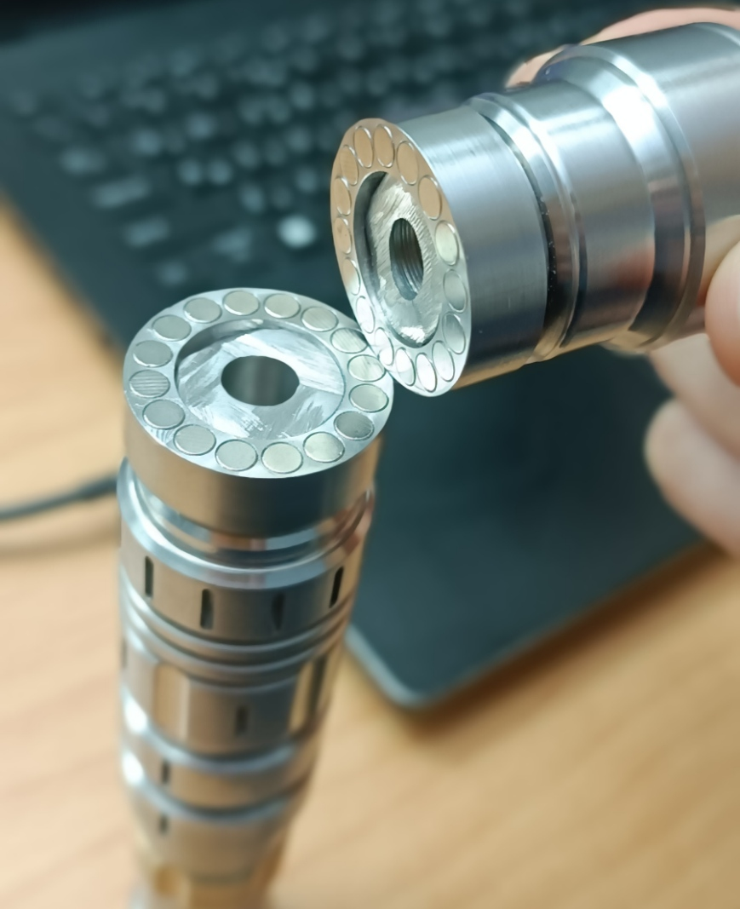

# Problem Statement

SanwuLasers™️ Lasers such as Striker, Challenger II, Laser Rangers all have option for high powered blue diode (~7 watts).

SanwuLasers™️ offers flashlight adapters that [can be screwed onto the top](./docs/laser_and_flashlight_adapter.jpg). It's generic, the flashlight adapter fits all of the aforementioned host types.

Problem is: It takes way too long to physically unscrew the flashlight adapter, and it's way too annoying to screw it back on. It should be possible to just pull it off, and snap it right back in place 🧲.

[magnet holes standard triangle language](./magnet_holes.stl)\
[final result male and female](./docs/final_xometry_male_and_female_result_cropped.png)



# Solution

Custom order for CNC machined stainless steel part that converts the screw-on mechanism into a magnetic mechanism!

The flashlight adapter can be ordered with an [Adapter for striker](#threads). This adapter is super useful because it's already threaded with male and female sides.

The generic custom machined part has 16 small holes, each 4.16mm in diameter and 3.30mm depth.

It just so happens that in practice, my choice of 3.30mm depth works with the [neodymium disc magnets](./docs/neodymium_magnets_amazon_listing.png) I chose, which according to the listing are **2mm in height** but apparently the [diameter is greater](./docs/amazon_magnet_diameter_not_as_advertized.jpg) and [height is less](./docs/amazon_magnet_height_not_as_advertized.jpg) than advertized.

Originally I was planning for one of the sides to have 2 magnets and the other to have 1 magnet to create a male-female pairing, but since the magnets were shorter than anticipated, 2 of them [perfectly fit](./docs/two_stacked_magnets_fit_in_3.3mm_hole_perfectly.jpg) in the purposefully shallow hole.

The magnets are **very** slightly extruding which does cause purple light to be slightly visible when flashlight mode is on, but it's still a [tight fit](./docs/tight_fit_despite_magnets_slightly_extruding.jpg).

The small gap is also a feature- it causes the flashlight adapter to **not** be air-tight which makes it easier to change focus without causing a vacuum (which was a feature that was bothering me in the default flashlight adapter behaviour).

I originally chose 4.04mm hole width but that was not enough, so then I changed the design to 4.16mm hole to make it easier to push-in the magnets.

# Process

I learned the recently released `FreeCAD 1.0.0`, but I gave up on the design once I understood that the software requires the user to draw shapes with my laptop's touchpad. I'm not an artist 🎨🧑‍🎨.

I decided it's much more robust to define the 3d design with words and precise measurements than it is to start drawing like a preschool child.

Therefore **for the initial version** I had `ChatGPT o1` write Python code to generate both a `.step` file and an `.stl` file, using [this prompt](./prompt.txt).

I use the `.stl` file to view the design in `Microsoft Paint 3d`, I then uploaded the `.step` file as-is to `Xometry` website.

I chose standard stainless steel [settings in the website](./docs/xometry_order_settings.png) with the lowest tolerance quality.

The reason I chose such a low tolerance quality is that I'm using super glue and I made the holes slightly bigger than they need to be, so it's fine. Also, I want the CNC machine to just do everything automatically to avoice human error.

# Threads

This adapter from SanwuLasers™️ is the base of my design.\
It already comes with [male threads](./docs/sanwu_striker_adapter_male_view.jpg) and [female threads](./docs/sanwu_striker_adapter_female_view.jpg).

The part can be ordered via its [dedicated listing](./docs/sanwu_adapter_order_separately.png) on the website, or as part of the [flashlight converter listing](./docs/sanwu_adapter_in_flashlight_converter_listing.png).

The adapter is 17.55 mm in diameter, so I cut a 17.60mm hole in the cylinder of my custom design.

I [cut the adapter in half](./docs/sanwu_adapter_cut_in_half.jpg) using a [diamond blade circular saw](./docs/angle_grinder/angle_grinder_readme.pdf), sand it down, and super glue the male part into the large hole in one of my generic custom machined parts, and the female part of the adapter from Sanwu into another unit of my generic custom machined part.

This is my alternative to reverse-engineering the threads that Sanwu uses.

Just for general knowledge, Sanwu uses the following threading specs:

- Male:
  ```txt
  CNC machined
  Metric right-handed male threaded rod
  11.45mm diameter teeth (crest-to-crest). 0.05mm smaller diameter than the female tap.
  0.5mm pitch
  3mm length out of which only the tip 2mm are threaded and the base 1mm runoff is shaved down and not threaded.
  That's total of 4 threads.
  ```
- Female (laser head):
  ```txt
  CNC machined
  Metric right-handed female
  m11.5x0.5 tap (11.5mm diameter, 0.5mm pitch)
  6mm depth- total of 12 threads
  ```

I chose to use threads from an existing SanwuLasers™️ adapter instead of printing my custom part [with designed threads](./docs/attempt_design_screw.png) for multiple reasons:
1. 11.5mm diameter is not standard.
2. Thread specification required English language specification, and can only exist in a step file for show (being pretty). This makes the whole process more expensive, and less automatic- it might make it hard for the CNC machine to know what to do!
3. I can always later design another custom stainless steel piece to fit into the generic 17.60mm hole with super glue, and I can decide to make it have threads! This incurs less risk by making the components modular.
4. Generic- single design works as either male or female screw side. Only having to print one step file multiple times is significantly cheaper because it only requires one preparation stage for Xometry.

# Recreate 3d model from code

You can decide to change parameters in [main.py](./main.py) then re-run the script to update the design files.

## Requirements
- Tested on Windows 11 Pro 23H2
- Ran with Python 3.10.6
- Specific versions chose: `pip install cadquery==2.4.0 numpy==1.23.5`

## Run
1. Delete the existing `.step` file and `.stl` file.
2. Run command `python magnet_holes_01_00_01.py` in a cmd window in the same directory as the project folder.
3. Use the newly created `magnet_holes.stl` and `magnet_holes.step`. Upload to PCBWay CNC machining, or to Xometry. Order at least 2 pieces because you need male and female.
4. Run command `python rangers_guard_sleeve_01_00_00.py` in a cmd window in the same directory as the project folder.
5. Use the newly created `rangers_guard_sleeve.stl` and `rangers_guard_sleeve.step`. PCBWay CNC machining, or to Xometry. Order 1 piece for your [Laser Rangers](https://www.sanwulasers.com/product/laserrangers).

## Assembly

Take [magnets and magnet_holes piece](./docs/magnets_and_xometry_magnet_holes.jpg) and insert the magnets using the following method:

1. Operate in a warm area (preferably hot plate that's greater than 40°C and lower than 75°C) so that the steel expands to the max it's every going to get.

2. Wear black nitrile gloves and protective goggles (laser safety goggles work).

3. Apply 1 drop of [Super glue](./docs/super_glue.jpg) into one of the 16 holes by tapping the inside bottom of the hole with the head of the nozzle.

4. Quickly insert 2 magnets together into the hole. Push with fingers, then wooden skewer and if need be, quickly use vice to push in the magnets quickly before any super glue hardens.

5. Quickly wipe off the top with paper towel to remove excess super glue.

6. Do the same for all 16 holes in either clockwise or counter clockwise order, placing in the magnets in alternating polarities- positive hole, negative hole, positive hole, negative hole. This is so the magnetic power doesn't accumulate. Essentially, so the entire piece as a whole doesn't become significantly magnetic. Also, this make every adjacent pair of magnets attracted to each other so they're "happy to be there".

7. Do this entire magnet insertion process for an additional `magnet_holes` piece (for the purpose of creating both male and female).

Next, [cut Sanwu adapter](#threads) with small angle grinder such that you're left with [male and female connector](./docs/sanwu_adapter_cut_in_half.jpg).

Verify that height of both male and female adapter half is less than 8.3mm. If not, grind carefully then sand down.

Verify that while using the vice you haven't deformed the circularness of the male and female side, and that you haven't damaged the male or female screw mechanism- essentially just try to screw in the male side to an actual laser head, and the female side with an actual flashlight adapter to make sure it fits.

Use [super glue](./docs/super_glue.jpg) to connect the male side to one of the `magnet_holes` pieces with magnets that we prepared, the the female side to the other.

Let it dry, and you'll be left with the [final male and female result](./docs/final_xometry_male_and_female_result.jpg).

If you want to use this for Striker laser host, you're done.

If you want to use this mechanism for Laser Rangers laser host, it's recommended to take [rangers_guard_sleeve_01_00_00](#rangers_guard_sleeve_01_00_00) and super glue it onto the male `magnet_holes` part while making sure the stairs perfectly fit the stairs in the laser rangers head.

# Release Notes

## rangers_guard_sleeve_01_00_00
[rangers_guard_sleeve_01_00_00.py](./rangers_guard_sleeve_01_00_00.py)

- Designed to be attached on with super glue to a `magnet_holes` piece (to the male side that's screwed onto the laser head).

- Keeps flashlight head secure on Laser Rangers model so it can only be pulled off straight-up which is the direction the magnets are strongest in.

- Fills-in ugly gap at the stairs of the **Laser Rangers** laser head- only compatible with [models 1, 2, 4, 5, 7, 8](./docs/laser_rangers_body_models.png). I recommend model 7 or model 2.

- Compatible with `magnet_holes_01_00_00` and with `magnet_holes_01_00_01`

- 2 units ordered [via PCBWay](./docs/pcbway_order_01.png)

## magnet_holes_01_00_01
[magnet_holes_01_00_01.py](./magnet_holes_01_00_01.py)

- 4.16mm diameter magnet holes for better fitting, instead of 4.04mm

- 2 units ordered [via PCBWay](./docs/pcbway_order_01.png)

## magnet_holes_01_00_00
[magnet_holes_01_00_00.py](./magnet_holes_01_00_00.py)\
[Xometry raw result](./docs/xometry_raw_result.jpg)\
[Final result](./docs/xometry_final_result.jpg)

- 4.04mm diameter magnet holes

- Generic- can be used with `rangers_guard_sleeve_01_00_00`.

- Generic- each piece can be used with [Sanwu Adapter](#threads) male or female.

- Generic- since the magnets [perfectly fit](./docs/tight_fit_despite_magnets_slightly_extruding.jpg), the male and female sides are interchangeable.

- 5 units ordered with https://get.xometry.eu/payments/ec0325ff-71c7-4672-9496-26f8077902b1
