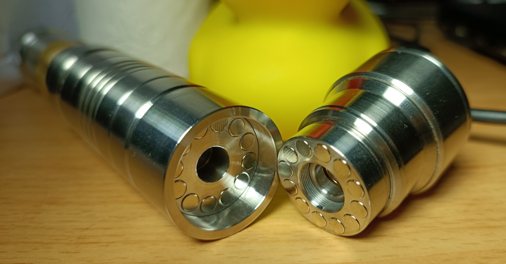

# Problem Statement

SanwuLasers™️ Lasers such as Striker, Challenger II, "Laser Rangers" all have option for high powered blue diode (~7 watts).

SanwuLasers™️ offers flashlight adapters that [can be screwed onto the laser head](./docs/laser_and_flashlight_adapter.jpg). It's generic, the flashlight adapter fits all of the aforementioned host types.

Problem is: It takes way too long to physically unscrew the flashlight adapter, and it's way too annoying to screw it back on. It should be possible to just pull it off, and snap it right back into place 🧲.



# Solution

Custom order CNC machined stainless steel parts that convert the screw-on mechanism into a magnetic mechanism!

## Manufacture with PCBWay CNC

### Disclaimer

The current [rangers_guard_sleeve_01_00_01](#rangers_guard_sleeve_01_00_01) piece is only compatible with Sanwu Laser Rangers with [body models 1, 2, 4, 5, 7, 8](./docs/laser_rangers_body_models.png). I recommend model 7 or model 2.

### Price
Price overview of [January 2025 order](./docs/pcbway_order_price_01_00_00.png) containing 3 items [male_thread_01_00_00](#male_thread_01_00_00) + [female_thread_01_00_00](#female_thread_01_00_00) + [rangers_guard_sleeve_01_00_01](#rangers_guard_sleeve_01_00_01):
1. **Items**: $113.73 USD (= ₪405.52 New Israeli Shekels)
2. **Shipping Fedex to Israel**: $40 USD (= ₪142.62 New Israeli Shekels)
3. **Israel customs import tax 🖕**: ₪235.46 New Israeli Shekels.\
Automatically charged by FEDEX CAYMAN ISLANDS same day as order arrival because I have a Fedex account.

**Total**: ~ ₪783.6 New Israeli Shekels when ordering to Israel.

### Order

PCBWay CNC service has shown ability to successfully manufacture [the threads](#threads) needed for the parts in this project (as of February 2025), but they don't guarantee successful manufacture of non-standard threads.

1. Sign-in to your PCBWay account, and upload each step file to [PCBWay CNC machining](./docs/pcbway_cnc_machining_upload.png). Start by uploading [male_thread.step](./male_thread_01_00_00/male_thread.step).

2. For all parts, choose material [stainless steel 303](./docs/pcbway_choose_stainless_steel_303.png).

3. For the `male_thread` and `female_thread` parts, click "Yes" on [Do your parts need to tap threads?](./docs/pcbway_click_yes_on_threads_and_tapped_holes.png)\
A [pop-up menu](./docs/pcbway_upload_technical_drawing.png) will appear- upload the relevant technical drawing for the current piece: [male_thread technical drawing](./male_thread_01_00_00/technical_drawing/technical_drawing.png) / [female_thread technical drawing](./female_thread_01_00_00/technical_drawing/technical_drawing.png).\
Leave `Inserts` marked "No" because our parts don't have any inserts.

4. For all parts, choose "Surface Finish" -> `Standard (As-Milled) (Ra 125μin)`.

5. For the `male_thread` and `female_thread` parts, choose "Surface Roughness" -> `125uin/3.2um Ra`.\
You can't change the default surface surface finish on `rangers_guard_sleeve` because we don't have a technical drawing for it.

6. For all parts, choose product description [robot components](./docs/pcbway_product_description_robot_parts.png) for import/customs purposes.\
Not sure if that's the best thing to report for Israeli customs but that's the option I've been choosing.

7. **Repeat steps 2 -> 6** for [female_thread.step](./female_thread_01_00_00/female_thread.step) and then again for [rangers_guard_sleeve.step](./rangers_guard_sleeve_01_00_01/rangers_guard_sleeve.step).\
Fill in the items for all 3 orders in the same window, and each time scroll down and [select additional files](./docs/pcbway_select_additional_step_files.png).

8. Click botton [submit request](./docs/pcbway_ready_to_submit_request.png).

9. After ~24 hours PCBWay will supply you with a price quote- hopefully no higher than initially estimated. Then you'll have the option to make the order (after a human has viewed your request).

10. Once you receive the parts, follow [Assembly](#assembly) steps.

# Development Process

Classical GUI-based CAD softwares are problematic for multiple reasons:

1. Sometimes requires user to draw shapes like an artist 🎨🧑‍🎨 instead of using precise definitions.

2. Write-only designs. A simple change in a basic parameter can require starting the design from scratch.

3. Cost money / require online connection- **FreeCAD 1.0.0** is no good yet. Wasn't able to find option to place multiple evenly-spaced holes around a radius.

4. Not text. Can you search "4.11" and change all occurences to a larger / smaller value? Can you ask ChatGPT for help with your design?

I decided it's more robust to define the 3d design with words and precise measurements than it is to use a GUI software.

Therefore I helped `ChatGPT o1` use Python library `import cadquery as cq` to create my 3d designs.

# Magnets

The custom machined male and female parts have 12 holes each, 3.30mm depth and 4.11mm diameter.

These sizes were fine tuned for a stack of two of the [neodymium disc magnets](./docs/neodymium_magnets_amazon_listing.png) I chose.

According to the listing these are **2mm in height** but notice that the [diameter is greater](./docs/amazon_magnet_diameter_not_as_advertized.jpg) and [height is much less](./docs/amazon_magnet_height_not_as_advertized.jpg) than advertized.

When stacking two magnets per hole, the magnets are **very** slightly extruding (0.15mm), for total of 0.3mm extra [gap created by the magnets](./docs/tight_fit_despite_magnets_slightly_extruding.jpg).

The small gap is also a feature- it causes the flashlight adapter to **not** be air-tight which makes it easier to change focus without causing a vacuum (which was always a feature that was bothering me in the default flashlight adapter behaviour).

I originally chose 4.04mm hole width but that was not enough, so then I changed the design to 4.16mm hole to make it easier to push-in the magnets. I then changed the design to 4.11mm diameter for a tight fit- so you now have to push-in each bottom magnet with a vice.

# Threads

Sanwu uses the following threading specs for the laser head and attachments:

- Male:
  ```txt
  CNC machined
  Metric right-handed male threaded rod
  11.45mm diameter teeth (crest-to-crest). 0.05mm smaller diameter than the female tap.
  0.5mm pitch
  3mm length out of which only the tip 2mm are threaded and the base 1mm runoff is shaved down and not threaded.
  That's total of 4 threads.
  ```
- Female (laser head):
  ```txt
  CNC machined
  Metric right-handed female
  m11.5x0.5 tap (11.5mm diameter, 0.5mm pitch)
  6mm depth- total of 12 threads
  ```

This adheres to standard: https://www.gewinde-normen.de/en/iso-fine-thread-2.html
```txt
ISO Metric Fine Thread DIN 13-3
Pitch mm: 0.5
Nominal (major) Diameter mm: M 11.5
```
Issue is that the aforementioned size is not a standard combination of **major diameter** + **pitch**.\
PCBWay CNC was able to machine it- because supposedly it's a standard size in China.

# Recreate 3d model from code

You can decide to change parameters in any of [male_thread.py](./male_thread_01_00_00/male_thread.py), [female_thread.py](./female_thread_01_00_00/female_thread.py), [rangers_guard_sleeve.py](./rangers_guard_sleeve_01_00_01/rangers_guard_sleeve.py) then re-run the script to update the design files.

Always update [male_thread_visual.py](./male_thread_01_00_00/male_thread_visual.py) in the same way you updated [male_thread.py](./male_thread_01_00_00/male_thread.py).\
Always update [female_thread_visual.py](./female_thread_01_00_00/female_thread_visual.py) in the same way you updated [female_thread.py](./female_thread_01_00_00/female_thread.py).

If you made a visual change to [male_thread.py](./male_thread_01_00_00/male_thread.py) or [female_thread.py](./female_thread_01_00_00/female_thread.py) then you should update [technical_drawing.png](./male_thread_01_00_00/technical_drawing/technical_drawing.png) / [technical_drawing.png](./female_thread_01_00_00/technical_drawing/technical_drawing.png) in **Microsoft Paint**.

The `XX_visual.py` files exist solely for technical drawing purposes- and each generates a `XX_visual.stl` file.\
Feel free to use [create_images.py](./male_thread_01_00_00/technical_drawing/create_images.py) / [create_images.py](./female_thread_01_00_00/technical_drawing/create_images.py) to generate updated images for use in the the technical drawing you're updating.

## Requirements
- Tested on Windows 11 Pro 23H2
- Ran with Python 3.10.6
- Specific versions chose: `pip install cadquery==2.4.0 numpy==1.23.5`

## Assembly

1. Prepare [the male the female pieces](./docs/pcbway_male_female_threads_01_00_00_raw.jpg), [the magnets](./docs/magnets_box_findmag.jpg), and a vice.

2. Insert a stack of 2 magnets with your hands into one of the holes- it won't push-in all the way and the top magnet will stick ~1mm out of the hole (as opposed to ~0.15mm when pushed in all the way).

3. Use a vice to push the stack all the way down- the bottom magnet is now stuck down there and will never come out, no glue needed.\
The top magnet is slightly sticking out (only ~0.15mm) and in practice is loose.

4. Use a stack of magnets to pull out the top magnet. If it comes out- good!\
If the top magnet doesn't come out by using attraction (due to machining tolerances) even when the entire piece is heated to 50° celsius (expanding the steel), that means we don't have to use glue for that hole.

5. Repeat steps 2 -> 4 for every hole in both pieces male and female. Insert the magnets into the holes in either clockwise or counter clockwise order, placing in the magnets in **alternating polarities**- positive hole, negative hole, positive hole, negative hole. This is so the magnetic power doesn't accumulate. Essentially, so the entire piece as a whole doesn't become significantly magnetic. Also, this make every adjacent pair of magnets attracted to each other so they're "happy to be there".\
We have now finished pushing-in a total of 24 magnets to the bottom of the 24 holes- and they're mechanically held in place quite tightly- and in the correct polarities.

6. Wear black nitrile gloves and protective goggles (laser safety goggles work)- and prepare the [super glue](./docs/good_super_glue_brand.jpg).\
Prepare paper towel as well to wipe off excess super glue. Move entire work area to baking paper surface to avoid sticking.\
Keep a vice nearby just in case.

7. **Note:** If a bottom magnet is loose in its hole (due to machining mishaps)- then you can use super glue on the entire stack of 2 magnets in one push. **Never use super glue more than once per hole** because that would cause an unreparable gap between the bottom magnet and the top magnet (due to the dried super glue) then you'll have to throw away the entire piece (I say this from experience). 

8. Apply 1 drop of super glue into one of the holes by tapping the bottom magnet of the hole with the head of the nozzle.

9. Hold the stack of magnets in the correct polarity for the hole, and quickly insert the top magnet and slide off the rest of the stack of magnets (such that now a stack of 2 magnets is in the hole). Quickly wipe the bottom of the magnet stack on paper towel to avoid the negative effect of excess super glue contaminating the magnet stack.\
Immediately push down hard on the just-inserted magnet with the same paper towel while rubbing away excess super glue.\
If even when pushing down with paper towel you see that the magnet isn't pushed-in all the way: use a vice ASAP. If only a minute has passed you might still have a chance to push the top magnet down to stop it from permanently sticking out.

10. Don't worry, you can reuse the paper towel because super glue immediately dries when exposed to paper towel. However- after each magnet insertion make sure to wipe off any drips of liquid super glue that may have fallen onto the baking paper's surface.

11. Repeat steps 7 -> 10 for each of the 24 holes.

12. Take a [rangers_guard_sleeve](#rangers_guard_sleeve_01_00_00) and the [male_thread](#male_thread_01_00_00) piece you just inserted 12 pairs of magnets into. Practice sliding the [male_thread](#male_thread_01_00_00) piece [screw side down](./docs/guard_sleeve_01_00_01_rangers_head.jpg) into the top of the [rangers_guard_sleeve](#rangers_guard_sleeve_01_00_00) piece.\
It's actually not that easy to push the piece [all the way down](./docs/guard_sleeve_01_00_01_assembled_bottom_view.jpg) because of the tight tolerance.\
Prepare Q-Tips and paper towel.

13. Precisely apply a small amount of super glue to [the inside of the bottom ring](./docs/guard_sleeve_01_00_01_inside_of_bottom_ring.jpg) then quickly slide-in the [male_thread](#male_thread_01_00_00) all the way down.

14. Very quickly start wiping the [top ring](./docs/guard_sleeve_01_00_01_top_ring.jpg) with paper towel. Just as quickly [wipe the bottom](./docs/guard_sleeve_01_00_01_area_to_wipe.jpg) with Q-tips to avoid any significant width of excess super glue from hardening.

15. If you failed to push all the way down (and the super glue hardened), push the [male_thread](#male_thread_01_00_00) out of the [rangers_guard_sleeve](#rangers_guard_sleeve_01_00_00) using a vice. Optionally, take [the female side](./docs/sanwu_striker_adapter_female_view.jpg) of a [Sanwu adapter for striker](./docs/sanwu_adapter_order_separately.png) to [gain leverage](./docs/gain_leverage.jpg) with the vice (without damaging our machined part).\
Finally scrape off the previously-applied super glue using a needle or other sharp metal rod, or by pushing in-and-out the [male_thread](#male_thread_01_00_00). Then try again to repeat steps 13 -> 14.

# Release Notes

## female_thread_01_00_00
[female_thread.py](./female_thread_01_00_00/female_thread.py)\
[PCBWay raw result](./docs/pcbway_female_thread_01_00_00_raw.jpg)\
Based on [magnet_holes_01_00_01](#magnet_holes_01_00_01)

- Only female, not generic. With builtin female threading (screw hole) instead of relying on [purchasing adapter from Sanwu](#threads) and using angle grinder.

- Smaller cylinder diameter- 24mm instead of 28mm. This is possible because that pesky Sanwu adapter used to take up 17.6mm in diameter where we couldn't place any magnets.

- Height- 6mm instead of 8.3mm. Small improvement to bulkiness in addition to the smaller male piece.

- To be utilized with [rangers_guard_sleeve_01_00_00](#rangers_guard_sleeve_01_00_00) instead of [rangers_guard_sleeve_01_00_01](#rangers_guard_sleeve_01_00_01).

- [Technical drawing](./female_thread_01_00_00/technical_drawing/technical_drawing.png) so that PCBWay can correctly manufacture the threads.

- 12 magnet holes instead of 16 (because we're now smaller). Should still be strong enough.

- 4.16mm magnet holes diameter was too big so I changed the design to 4.11mm diameter for a perfect fit.

## male_thread_01_00_00
[male_thread.py](./male_thread_01_00_00/male_thread.py)\
[PCBWay raw result top](./docs/pcbway_male_thread_01_00_00_raw.jpg)\
[PCBWay raw result bottom](./docs/pcbway_male_female_threads_01_00_00_raw.jpg)\
Based on [magnet_holes_01_00_01](#magnet_holes_01_00_01)

- Only male, not generic. With builtin male threading (screw) instead of relying on [purchasing adapter from Sanwu](#threads) and using angle grinder.

- Smaller cylinder diameter- 24mm instead of 28mm. This is possible because that pesky Sanwu adapter used to take up 17.6mm in diameter where we couldn't place any magnets.

- Height- 4.3mm (not including male thread rod) instead of 8.3mm. This makes the entire assembled system less bulky.

- To be utilized with [rangers_guard_sleeve_01_00_00](#rangers_guard_sleeve_01_00_00) instead of [rangers_guard_sleeve_01_00_01](#rangers_guard_sleeve_01_00_01).

- [Technical drawing](./male_thread_01_00_00/technical_drawing/technical_drawing.png) so that PCBWay can correctly manufacture the threads.

- 12 magnet holes instead of 16 (because we're now smaller). Should still be strong enough.

- 4.16mm magnet holes diameter was too big so I changed the design to 4.11mm diameter for a perfect fit.

## rangers_guard_sleeve_01_00_01
[rangers_guard_sleeve_01_00_00.py](./rangers_guard_sleeve_01_00_01/rangers_guard_sleeve.py)
[PCBWay raw result](./docs/pcbway_guard_sleeve_01_00_01_raw.jpg)

- Slightly narrower steps- so the fit onto the Laser Rangers head is more snug and secure (less dependent on screw mechanism)

- Different length and internal and external diameters to fit the now smaller and thinner [male_thread](./male_thread_01_00_00/) and [female_thread](./female_thread_01_00_00/)

## rangers_guard_sleeve_01_00_00
[rangers_guard_sleeve_01_00_00.py](./old/rangers_guard_sleeve_01_00_00.py)\
[PCBWay raw result](./docs/pcbway_guard_sleeve_01_00_01_raw.jpg)

- Designed to be attached on with [super glue](./docs/bad_super_glue_brand.jpg) to a `magnet_holes` piece (to the male side that's screwed onto the laser head).

- Keeps flashlight head secure on Laser Rangers model so it can only be pulled off straight-up which is the direction the magnets are strongest in.

- Fills-in ugly gap at the stairs of the **Laser Rangers** laser head- only compatible with [models 1, 2, 4, 5, 7, 8](./docs/laser_rangers_body_models.png). I recommend model 7 or model 2.

- Compatible with `magnet_holes_01_00_00` and with `magnet_holes_01_00_01`

- 2 units ordered [via PCBWay](./docs/pcbway_order_01.png)

## magnet_holes_01_00_01
[magnet_holes_01_00_01.py](./old/magnet_holes_01_00_01.py)\
[PCBWay raw result](./docs/pcbway_magnet_holes_and_guard_sleeve.jpg)

- 4.16mm diameter magnet holes for better fitting, instead of 4.04mm

- 2 units ordered [via PCBWay](./docs/pcbway_order_01.png)

## magnet_holes_01_00_00
[magnet_holes_01_00_00.py](./old/magnet_holes_01_00_00.py)\
[Xometry raw result](./docs/xometry_raw_result.jpg)\
[Final result](./docs/xometry_final_result.jpg)

- 4.04mm diameter magnet holes

- Generic- can be used with `rangers_guard_sleeve_01_00_00`.

- Generic- each piece can be used with [Sanwu Adapter](#threads) male or female.

- Generic- since the magnets [perfectly fit](./docs/tight_fit_despite_magnets_slightly_extruding.jpg), the male and female sides are interchangeable.

- 5 units ordered with https://get.xometry.eu/payments/ec0325ff-71c7-4672-9496-26f8077902b1
