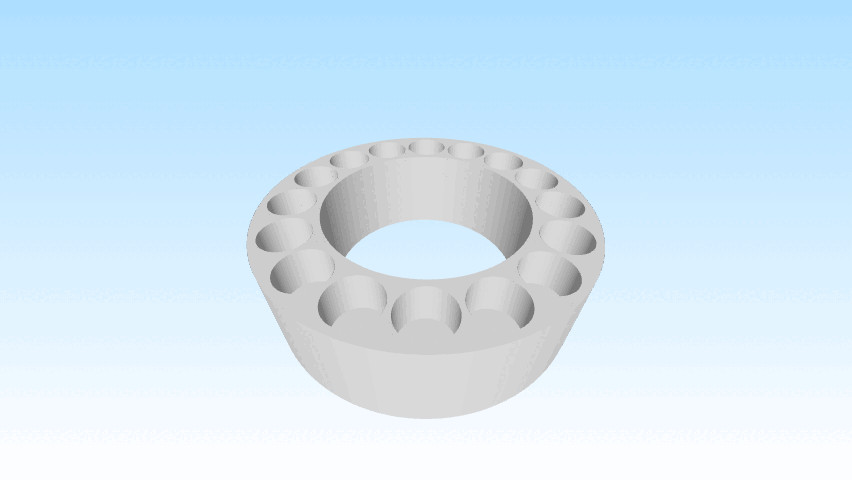

# Problem Statement

SanwuLasers™️ Lasers such as Striker, Challenger II, Laser Rangers all have option for high powered blue diode (~7 watts).

SanwuLasers™️ offers flashlight adapters that can be screwed onto the top. It's generic, the flashlight adapter fits all of the aforementioned host types.

Problem is: It takes way too long to physically unscrew the flashlight adapter, and it's way too annoying to screw it back on. It should be possible to just pull it off, and snap it right back in place 🧲.



# Solution

Custom order for CNC machined stainless steel part that converts the screw-on mechanism into a magnetic mechanism!

The flashlight adapter can be ordered with an [Adapter for striker](#threads). This adapter is super useful because it's already threaded with male and female sides.

The generic custom machined part has 16 small holes, each 4.04mm in diameter and 3.30mm depth.

I specifically chose that 3.30mm depth so that I can use with 4mm diameter [neodymium disc magnets](./docs/neodymium_magnets_amazon_listing.png) that have a **2mm height** (not a typo). 

That allows me to decide whether a magnet hole is male or female. I can either put 2 magnets in the hole, which will cause the top magnet to extrude ~1mm (male), or I can choose to put only 1 magnet in the hole which will leave a ~1mm depth hole (female).

I chose 3.30mm instead of 3.00mm to leave some room for super glue.\
I chose 4.04mm instead of 4.00mm to leave some room for machine error and for super glue.

# Process

I learned the recently released `FreeCAD 1.0.0`, but I gave up on the design once I understood that the software requires the user to draw shapes with my laptop's touchpad. I'm not an artist 🎨🧑‍🎨.

I decided it's much more robust to define the 3d design with words and precise measurements than it is to start drawing like a preschool child.

Therefore I had `ChatGPT o1` + `ChatGPT 4o` write Python code to generate both a `.step` file and an `.stl` file, using [this prompt](./prompt.txt).

I use the `.stl` file to view the design in `Microsoft Paint 3d`, I uploaded the `.step` file as-is to `Xometry` website.

I chose standard stainless steel [settings in the website](./docs/xometry_order_settings.png) with the lowest tolerance quality.

The reason I chose such a low tolerance quality is that the shape is so simple, that I expect a CNC machine to automatically know how to precisely make the cuts directly from the step file, so it's probably gonna be precise enough.

# Threads

This adapter from SanwuLasers™️ is the base of my design.\
It already comes with [male threads](./docs/sanwu_striker_adapter_male_view.jpg) and [female threads](./docs/sanwu_striker_adapter_female_view.jpg).

The part can be ordered via its [dedicated listing](./docs/sanwu_adapter_order_separately.png) on the website, or as part of the [flashlight converter listing](./docs/sanwu_adapter_in_flashlight_converter_listing.png).

The adapter is 17.55 mm in diameter, so I cut a 17.60mm hole in the cylinder of my custom design.

I plan to cut the adapter in half using a diamond blade circular saw, sand it down, and superglew the male part into the large hole in one of my generic custom machined parts, and the female part of the adapter from Sanwu into another unit of my generic custom machined part.

This is my alternative to reverse-engineering the threads that Sanwu uses.

Just for general knowledge, Sanwu uses the following threading specs:

- Male:
  ```txt
  CNC machined
  Metric right-handed male threaded rod
  11.45mm diameter teeth (crest-to-crest). 0.05mm smaller diameter than the female tap.
  0.5mm pitch
  3mm length out of which only the tip 2mm are threaded and the base 1mm runoff is shaved down and not threaded.
  That's total of 4 threads.
  ```
- Female (laser head):
```txt
  CNC machined
  Metric right-handed female
  m11.5x0.5 tap (11.5mm diameter, 0.5mm pitch)
  6mm depth- total of 12 threads
```

I chose to use threads from an existing SanwuLasers™️ adapter instead of printing my custom part [with designed threads](./docs/attempt_design_screw.png) for multiple reasons:
1. 11.5mm diameter is not standard.
2. Thread specification required English language specification, and can only exist in a step file for show (being pretty). This makes the whole process more expensive, and less automatic- it might make it hard for the CNC machine to know what to do!
3. I can always later design another custom stainless steel piece to fit into the generic 17.60mm hole with superglew, and I can decide to make it have threads! This incurs less risk by making the components modular.
4. Generic- single design works as either male or female screw side. Only having to print one step file multiple times is significantly cheaper because it only requires one preparation stage for Xometry.

# Recreate 3d model from code

You can decide to change parameters in [main.py](./main.py) then re-run the script to update the design files.

## Requirements
- Tested on Windows 11 Pro 23H2
- Ran with Python 3.10.6
- Specific versions chose: `pip install cadquery==2.4.0 numpy==1.23.5`

## Run
1. Delete the existing `.step` file and `.stl` file.
2. Run command `python main.py` in a cmd Window in the same directory as the project folder.
3. Use the newly created `toilet_paper_roll_with_magnet_holes.stl` and `toilet_paper_roll_with_magnet_holes.step`.

# Ordered and payed:
5 units ordered https://get.xometry.eu/payments/ec0325ff-71c7-4672-9496-26f8077902b1
